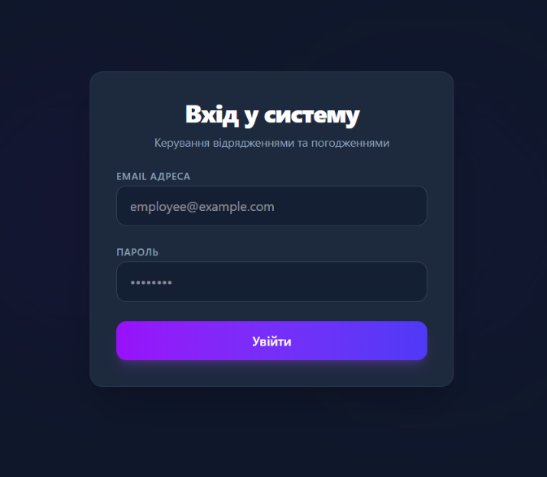
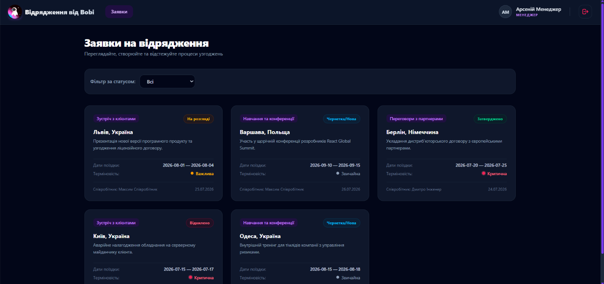
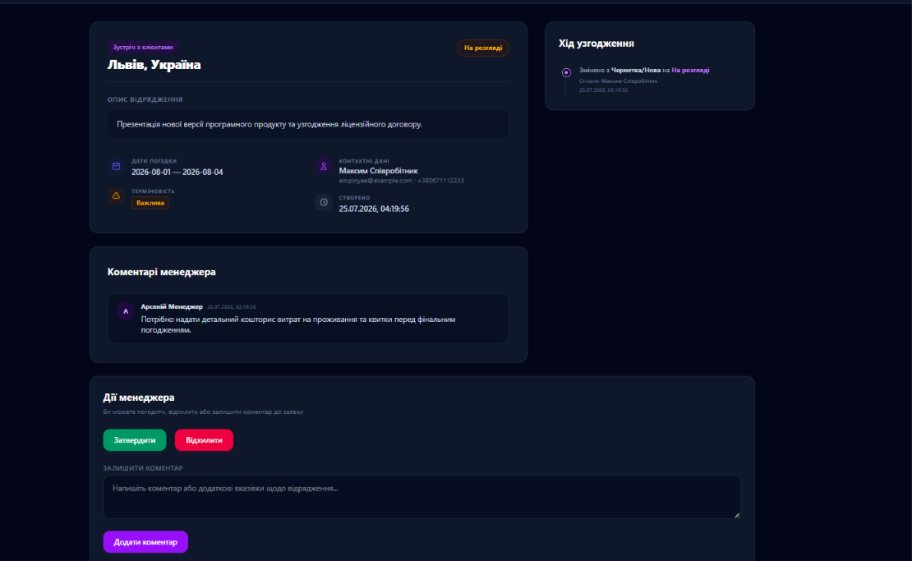

# Система узгодження відряджень

Це клієнтський веб-додаток (SPA), створений для автоматизації процесу подання та узгодження заявок на відрядження. Проект розроблено на **React** та **TypeScript** і демонструє роботу з формами, станом, маршрутизацією та імітацією серверної частини.

---

## 🖼️ Скріншоти

|               Сторінка входу               |               Список заявок (Менеджер)                |                    Картка заявки                     |
| :----------------------------------------: | :---------------------------------------------------: | :--------------------------------------------------: |
|  |  |  |

---

## ✨ Основні можливості

### Для Співробітника:

- **Вхід у систему** під своєю роллю.
- **Створення нової заявки** на відрядження через зручну форму.
- **Перегляд списку** лише своїх поданих заявок.
- **Відстеження статусу** узгодження кожної заявки.

### Для Менеджера:

- **Перегляд загального списку** всіх заявок у компанії.
- **Фільтрація заявок** за статусом (наприклад, "На розгляді", "Затверджено").
- **Перегляд детальної картки** будь-якої заявки.
- **Зміна статусу** заявки (затвердження або відхилення).
- **Додавання коментарів** до заявок для уточнення деталей.

---

## Запуск проекту локально

Щоб запустити проект на вашому комп'ютері, виконайте наступні кроки:

```bash
# 1. Встановити залежності
# (переконайтесь, що у вас встановлено Node.js)
npm install

# 2. Запустити dev-сервер (з MSW)
# Додаток запуститься в режимі розробки
npm run dev
```

Додаток буде доступний на [http://localhost:5173](http://localhost:5173).

### Тестові облікові записи

| Роль         | Email                  | Пароль        |
| ------------ | ---------------------- | ------------- |
| Співробітник | `employee@example.com` | `employee123` |
| Менеджер     | `manager@example.com`  | `manager123`  |

---

## 🧪 Запуск тестів

```bash
# Запустити інтеграційні тести (Vitest + RTL)
npm run test

# Запустити тести в режимі спостереження
npm run test:watch
```

---

## 📂 Структура проекту (Feature-Sliced Design Lite)

Проект організовано за принципами **Feature-Sliced Design (Lite)**, що забезпечує чіткий поділ відповідальності та полегшує масштабування.

```text
src/
├── app/                    # Глобальні налаштування, провайдери, маршрутизація
│   ├── layouts/            # Компоненти-обгортки для сторінок (з навбаром, без нього)
│   ├── providers/          # Глобальні провайдери (UI-повідомлення, теми)
│   └── router.tsx          # Налаштування React Router, захищені маршрути
│
├── pages/                  # Сторінки, що відповідають конкретним URL
│   ├── login/              # Сторінка входу в систему
│   ├── business-trips/     # Сторінка зі списком заявок та формою створення
│   ├── trip/               # Сторінка з детальною інформацією про заявку
│   └── not-found/          # Сторінка 404 Not Found
│
├── widgets/                # Великі, самодостатні блоки UI
│   └── ToastContainer.tsx  # Контейнер для відображення спливаючих повідомлень
│
├── features/               # Функціонал, що несе бізнес-цінність (дії користувача)
│   ├── auth-by-email/      # Логіка та UI для форми авторизації
│   ├── auth-me/            # Логіка запиту даних поточного користувача
│   ├── create-trip/        # Форма та логіка створення нової заявки
│   ├── approve-trip/       # Кнопки та логіка для зміни статусу заявки
│   └── add-manager-comment/# Форма та логіка додавання коментаря
│
├── entities/               # Бізнес-сутності та їх компоненти
│   ├── trip/               # Все, що стосується сутності "Заявка"
│   │   ├── model/          # Типи, API-запити, хуки для роботи з заявками
│   │   └── ui/             # Компоненти для відображення заявок (картка, деталі)
│   └── user/               # Все, що стосується сутності "Користувач"
│       └── model/          # Сховище стану авторизації (Zustand)
│
├── shared/                 # Перевикористовуваний код, не пов'язаний з бізнес-логікою
│   ├── api/                # Налаштування API-клієнта та мок-сервера
│   │   ├── axiosInstance.ts# Екземпляр Axios з інтерсепторами (токен, обробка 401)
│   │   ├── tripApi.ts      # Функції для запитів, пов'язаних із заявками
│   │   ├── statusApi.ts    # Функції для запитів довідників (статуси, цілі)
│   │   └── mock/           # Імітація бекенду за допомогою MSW
│   │       ├── db.ts       # "База даних" в пам'яті з початковими даними
│   │       ├── handlers.ts # Обробники запитів для всіх ендпоінтів
│   │       ├── browser.ts  # Ініціалізація MSW для браузера
│   │       └── server.ts   # Ініціалізація MSW для тестів
│   ├── ui/                 # Базові UI-компоненти (кнопки, іконки, спінери)
│   └── lib/                # Допоміжні функції та хуки
│
└── test/                   # Інтеграційні та unit-тести
    ├── setup.ts            # Глобальні налаштування для тестового середовища
    └── integration/        # Тести, що перевіряють взаємодію компонентів
```

---

## 🏛️ Архітектурні рішення

### Mock API (MSW v2)

- Всі HTTP-запити перехоплюються **MSW (Mock Service Worker)** у браузері через `setupWorker`.
- В тестах використовуються ті самі `handlers` через `msw/node → setupServer`, що гарантує консистентність.
- База даних в пам'яті (`db.ts`) містить seed-дані з 5 заявками, 2 коментарями, 2 записами в історії, 2 користувачами — як вимагає `mock-db.md`.
- Штучна затримка `delay(800ms)` на ендпоінтах списків для демонстрації loading-стану.

### Система повідомлень (Toast, Context API)

- **`UIProvider`** — React Context із масивом `toasts[]` та функціями `addToast / removeToast`.
- **`ToastContainer`** — рендерить активні повідомлення в правому нижньому куті.
- Тости автоматично зникають через 3 секунди (`setTimeout`), або їх можна закрити кліком.
- Використовується при: вході, помилці входу, створенні заявки, зміні статусу, помилках API.

### Авторизація (Axios Interceptors)

- **Request interceptor**: додає `Authorization: Bearer <token>` з `localStorage` до кожного запиту.
- **Response interceptor**: при отриманні `401` — очищує `localStorage` і перенаправляє на `/login`.

### Server State (TanStack Query v5)

- `useQuery` — для читання даних (список, картка, коментарі, історія, довідники).
- `useMutation` — для POST/PATCH-запитів.
- `invalidateQueries` після кожної мутації для автоматичного оновлення кешу.
- Обробка станів: `isLoading`, `isError`, Empty State через окремі гілки UI.

### Оптимізація (Lazy Loading)

- `BusinessTripDetailsPage` та `CreateBusinessTripPage` завантажуються через `React.lazy()` + `<Suspense>`.
- При переході показується спінер-заглушка (`PageLoader`).

---

## 🗣️ Реалізовані користувацькі сценарії

1. **Вхід за роллю** — форма з RHF + Zod-валідацією, `useRef`-автофокус на поле Email.
2. **Список своїх заявок (employee)** — GET `/business-trips/my`, завантаження зі spinner, empty state.
3. **Список усіх заявок (manager)** — GET `/business-trips`, фільтр за статусом через Search Params в URL.
4. **Створення заявки** — форма з усіма полями, POST → редірект на `/business-trips/:id`.
5. **Перегляд деталей** — двоколонковий dashboard (дані + timeline + коментарі).
6. **Зміна статусу (manager)** — PATCH `/business-trips/:id/status` → оновлення кешу.
7. **Додавання коментаря (manager)** — POST `/business-trips/:id/comments` → оновлення картки.
8. **Розлогування при 401** — автоматичне очищення сесії через Axios interceptor.
